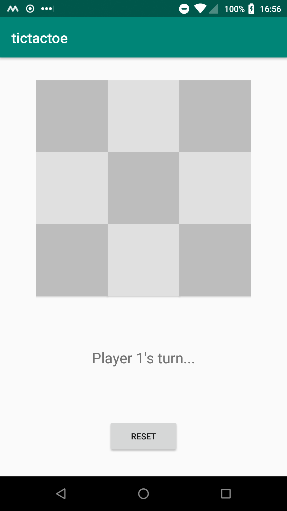
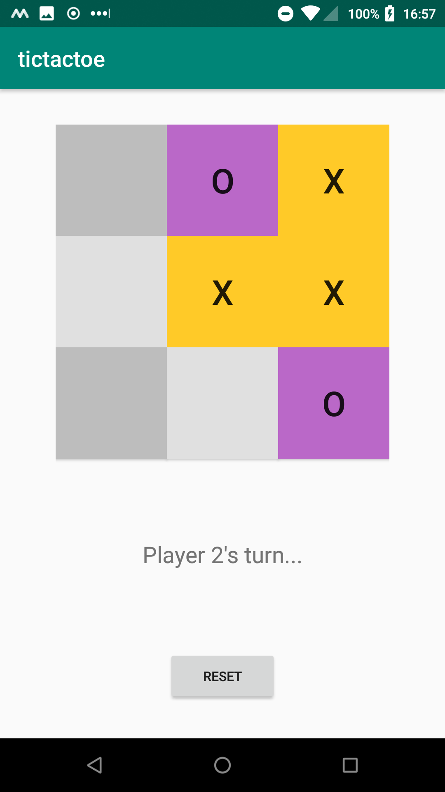
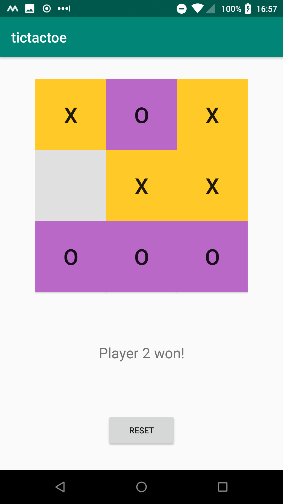
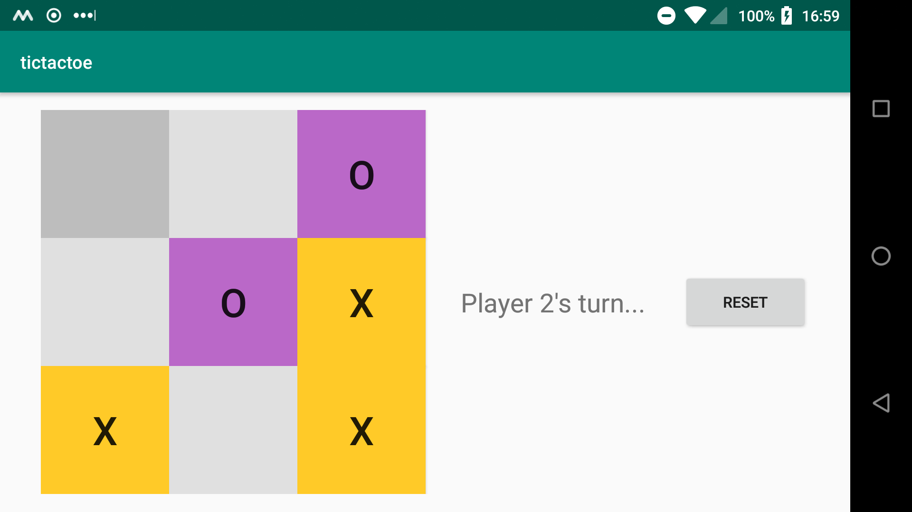

# tictactoe

This is a simple tic tac toe game. The players place their mark by tapping a tile. The players can reset the game with the reset button. Rotating the device keeps the game state.

__Now includes an amazing statusbar that informs the players whose turn it is, who won, and if there is a draw.__

A toast message informs the players of an invalid move.

A new game.

A game in progress.

A finished game.

A game on a horizontal device.

